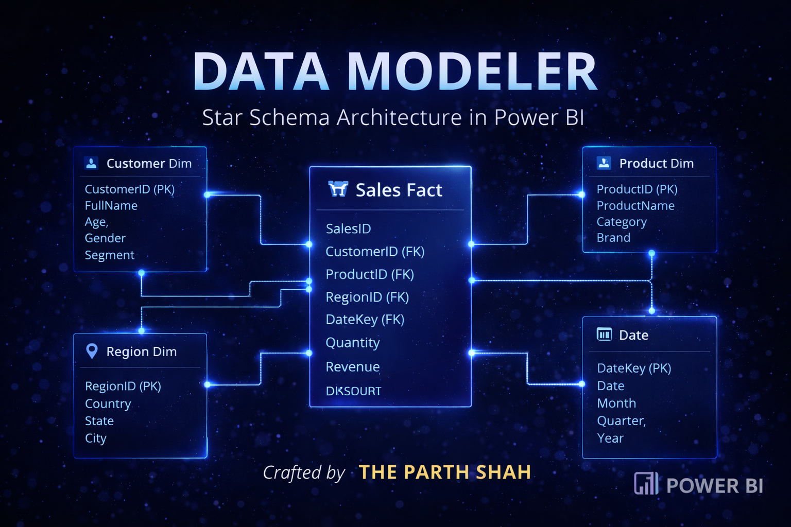
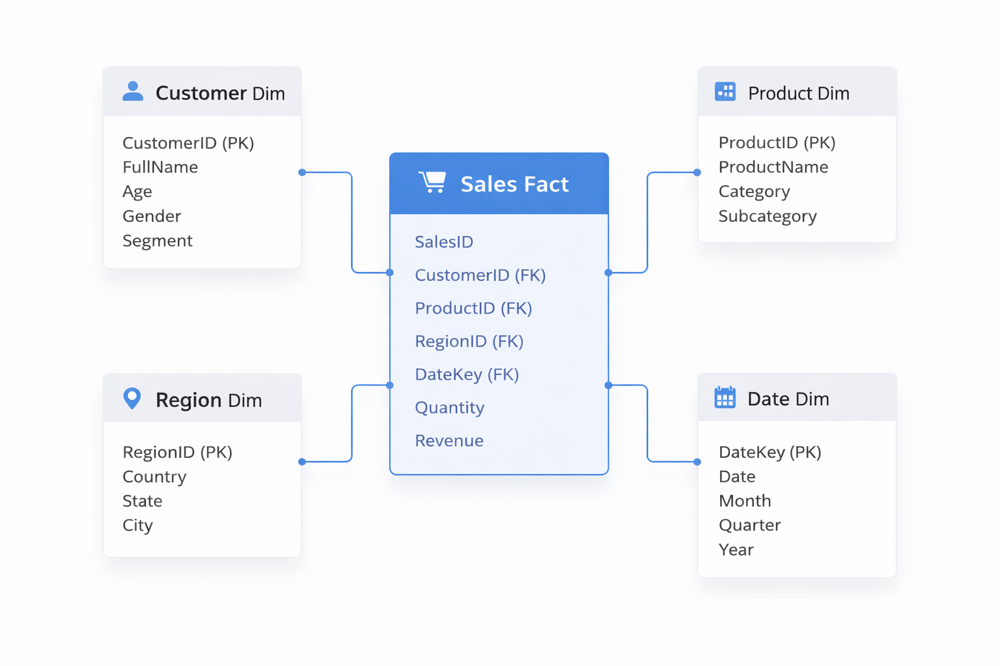
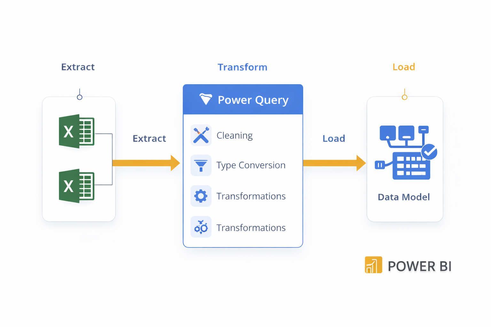
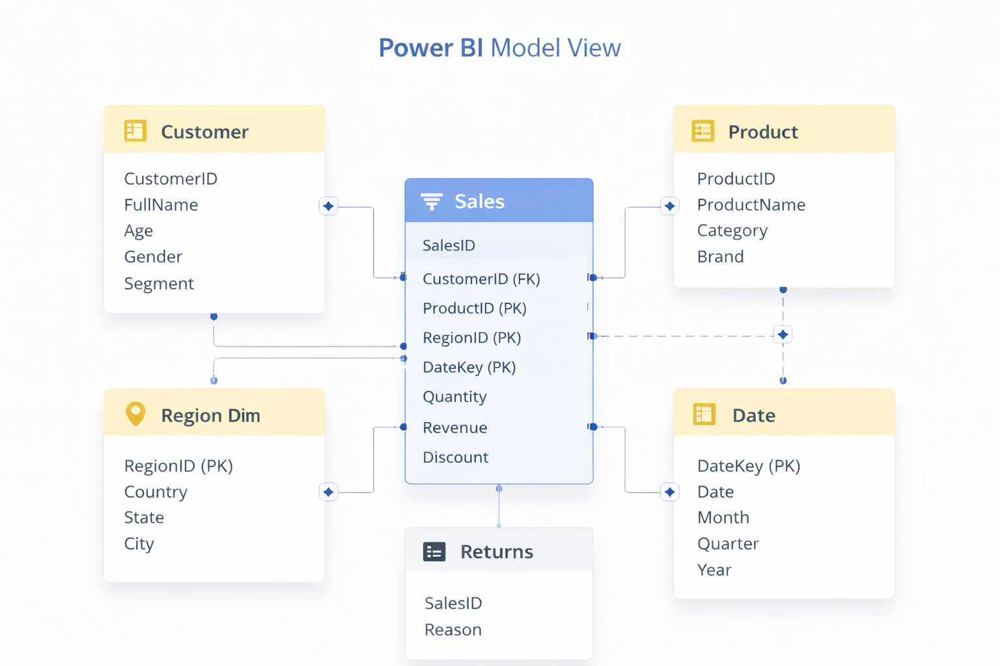
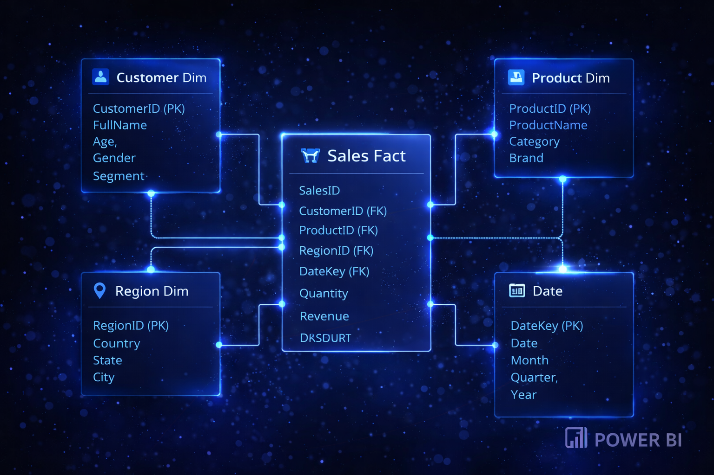
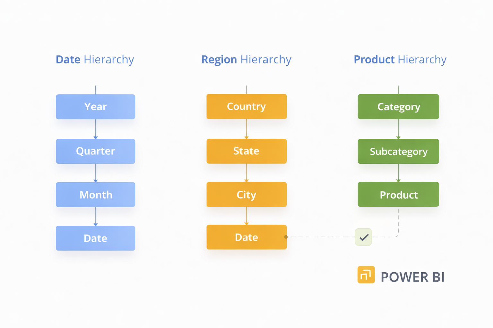

<div align="center">

# 🧠 DATA MODELER
### Building a Professional Star Schema Data Model in Power BI

### 👑 A Business Intelligence Architecture Project by **THE PARTH SHAH**


## 📚 Table of Contents

- [The Story](#-the-story)
- [The Challenge](#-the-challenge)
- [Quick Architecture Overview](#-quick-architecture-overview)
- [Data Model Architecture](#-data-model-architecture)
- [Power Query Transformations](#-power-query-transformations)
- [Relationship Design](#-relationship-design)
- [Hierarchies Implemented](#-hierarchies-implemented)
- [Testing the Model](#-testing-the-model)
- [Model Verification](#-model-verification)
- [Data Dictionary](#-data-dictionary)
- [Lessons Learned](#-lessons-learned)
- [Future Improvements](#-future-improvements)
- [Project Structure](#-project-structure)



> “Raw data is noise.  
> Structured models are intelligence.”  
> — THE PARTH SHAH

</div>

---

# 🎬 THE STORY

Every dataset begins as chaos.

Six Excel files.  
Hundreds of rows.  
Disconnected tables.

No relationships.  
No hierarchy.  
No intelligence.

But chaos is simply **structure waiting to be engineered.**

This project transforms scattered datasets into a **fully normalized star schema data model** using **Power BI Power Query and Model View**.

No dashboards.  
No flashy charts.

Just **pure data modeling discipline.**

Because before analytics begins,  
**architecture must exist.**

---

# 🧩 THE CHALLENGE

Design a professional **Power BI data model** capable of:

• Handling multiple dimension tables  
• Creating correct **primary & foreign key relationships**  
• Designing a **Star Schema architecture**  
• Managing **inactive relationships and ambiguous paths**  
• Implementing **hierarchies for analytical navigation**

The objective was simple:

> Build the **foundation of a real Business Intelligence system.**

---

# ⚡ Quick Architecture Overview

<div align="center">

### Excel Data Sources
 ↓ 
### Power Query (ETL)
 ↓
### Data Cleaning & Type Conversion
 ↓
### Dimensional Modeling
 ↓
### Star Schema Data Model
 ↓
### Power BI Analysis
</div>

---
# 🧠 DATA MODEL ARCHITECTURE



This model follows the **Star Schema design**, one of the most widely used architectures in enterprise BI systems.

At the center lies the **Sales Fact Table**, connected to multiple **dimension tables** that describe business entities.

| Table | Type | Description |
|------|------|-------------|
| Sales_Fact | Fact | Core transactional data |
| Customer_Dim | Dimension | Customer attributes |
| Product_Dim | Dimension | Product hierarchy |
| Region_Dim | Dimension | Geographic structure |
| Date_Dim | Dimension | Time intelligence |
| Returns_Fact | Fact | Product return transactions |

This structure enables **fast filtering, aggregation, and scalable reporting**.

---

# ⚙️ POWER QUERY TRANSFORMATIONS



Inside **Power Query**, the following transformations were implemented:

### 🧼 Data Cleaning
• Removed blank rows  
• Standardized column headers  
• Applied correct data types  
• Ensured primary key uniqueness

### 🔧 Data Preparation
• Structured dimension tables  
• Verified foreign key consistency  
• Ensured model readiness for relationships

All logic was implemented **exclusively in Power Query**, as required.

---

# 🔗 RELATIONSHIP DESIGN



Relationships were manually defined using **Model View**.

| Relationship | Cardinality |
|--------------|-------------|
Sales_Fact → Customer_Dim | 1 : Many |
Sales_Fact → Product_Dim | 1 : Many |
Sales_Fact → Region_Dim | 1 : Many |
Sales_Fact → Date_Dim | 1 : Many |
Returns_Fact → Sales_Fact | Many : 1 |

### ⚠ Handling Ambiguous Paths

When linking **Returns_Fact to Date_Dim**, Power BI detected multiple filter paths.

To resolve this:

✔ The relationship **Returns_Fact → Date_Dim** was set as **Inactive**

This prevents circular filter propagation and preserves model integrity.



The model relationships form the backbone of the architecture.  
Each dimension table filters the **Sales_Fact** table using correctly defined **Primary Key → Foreign Key** relationships.

This ensures:

• Clean filter propagation  
• Predictable aggregation behavior  
• Scalable analytical queries

---

---

# 🔄 RELATIONSHIP FLOW VISUALIZATION


This animated visualization demonstrates how dimension tables propagate filters through the model into the **Sales Fact Table**.

The animation highlights:

• Star schema structure  
• Dimension filtering paths  
• Fact table aggregation flow  
• Overall model connectivity

Understanding these flows is essential for designing **reliable enterprise BI models**.


# 🏗 HIERARCHIES IMPLEMENTED



Hierarchies allow structured drill-down analysis within reports and provide logical navigation paths for analytical exploration.

Hierarchies enable **drill-down navigation in reports**.

### 📅 Date Hierarchy
```

Year
└ Quarter
└ Month
└ Date

```

### 🌍 Region Hierarchy
```

Country
└ State
└ City

```

### 🛍 Product Hierarchy
```

Category
└ Subcategory
└ Product Name

```

These hierarchies create **structured analytical navigation**.

---

# 🧪 Testing the Model

To verify the correctness of relationships and hierarchy structures, a **Matrix visual** was used inside Power BI.

### Test Scenarios

• Sales aggregated by **Product Category and Region**  
• Return reasons analyzed by **Fiscal Year**  
• Revenue grouped by **Customer Segment**

These tests confirmed that:

- filter propagation works correctly  
- dimensional hierarchies function as expected  
- the star schema relationships behave consistently during aggregation

---
# 📊 MODEL VERIFICATION

Although the assignment required **no visual dashboards**, a **Matrix Table** was used to verify filter flow.

Validation scenarios included:

✔ Sales grouped by **Product Category & Region**  
✔ Return reasons analyzed by **Fiscal Year**  
✔ Revenue aggregated by **Customer Segment**

This ensured relationships and hierarchies function correctly.

---

# 📘 Data Dictionary

| Column | Table | Description |
|------|------|-------------|
| CustomerID | Customer_Dim | Unique customer identifier |
| ProductID | Product_Dim | Unique product identifier |
| RegionID | Region_Dim | Geographic region identifier |
| DateKey | Date_Dim | Calendar date key |
| SalesID | Sales_Fact | Transaction identifier |
| ReturnID | Returns_Fact | Return transaction identifier |

---

# 🧠 KEY DATA MODELING CONCEPTS DEMONSTRATED

• Star Schema Architecture  
• Fact vs Dimension Tables  
• Primary & Foreign Keys  
• Relationship Cardinality  
• Cross-filter Direction  
• Handling Ambiguous Paths  
• Inactive Relationships  
• Hierarchical Data Navigation

---

# 🏗 PROJECT STRUCTURE

```

Data_Modeler/
│
├── Data_Modeler.pbix
├── Data_Modeler_Project_Report.pdf
├── README.md
├── LICENSE
├── .gitignore
│
├── datasets/
│   ├── Sales_Fact.xlsx
│   ├── Customer_Dim.xlsx
│   ├── Product_Dim.xlsx
│   ├── Region_Dim.xlsx
│   ├── Date_Dim.xlsx
│   └── Returns_Fact.xlsx
│
└── images/
├── social_preview.png
├── relationships.png
├── schema.png
├── power_query.png
├── model_view.png
├── hierarchies.png
└── animation.gif

```

---

# 🚀 HOW TO RUN

1️⃣ Download the repository

2️⃣ Open the `.pbix` file using **Power BI Desktop**

3️⃣ Navigate to **Model View**

4️⃣ Explore the **Star Schema architecture**

5️⃣ Use the **Matrix table** to verify relationship flow

---

# 🎯 WHY THIS PROJECT STANDS OUT

This project demonstrates:

✔ Professional **data modeling discipline**  
✔ Clean **star schema architecture**  
✔ Correct **relationship management**  
✔ Handling **ambiguous filter paths**  
✔ Enterprise-style **hierarchy design**

It represents the **foundation of Business Intelligence systems**.

---

# 👑 THE PARTH SHAH PHILOSOPHY

Most people jump directly to dashboards.

But true analysts know:

> **If the data model is weak, the insights will be weak.**

So before visualization comes **architecture**.

Before charts comes **structure**.

Before dashboards comes **discipline**.

And that discipline is the difference between  
someone who uses Power BI…

and someone who **engineers intelligence**.

---

# 📚 Lessons Learned

Building this project reinforced several important BI modeling principles:

• Star schemas simplify analytical queries and reporting.  
• Correct primary and foreign keys prevent ambiguous relationships.  
• Inactive relationships help resolve multiple filter paths.  
• Hierarchies allow structured drill-down analysis.

These practices form the foundation of scalable Business Intelligence systems.

---

# 🚀 Future Improvements

Possible extensions of this project include:

• Creating interactive dashboards based on the model  
• Adding advanced DAX measures for deeper analytics  
• Integrating additional fact tables  
• Automating data ingestion pipelines

These improvements would transform the model into a complete end-to-end BI solution.

---
# 👑 THE PARTH SHAH SIGNATURE

I don't just build projects.

I design **data systems**.

From raw datasets to structured intelligence —  
every project here reflects a mindset of:

• precision  
• architecture  
• storytelling through data

Because data is not just numbers.

It is **power waiting to be modeled.**

— **THE PARTH SHAH**
---

<div align="center">

---

# 🤝 LET'S CONNECT

If you're interested in **Data Modeling, Business Intelligence, AI, or Analytics Engineering**, feel free to connect.

<div align="center">


[](https://www.linkedin.com/in/parth-shah-28387532b/)

</div>

### ⭐ If this project inspired you, consider starring the repository.

Built with precision by **THE PARTH SHAH**

</div>


